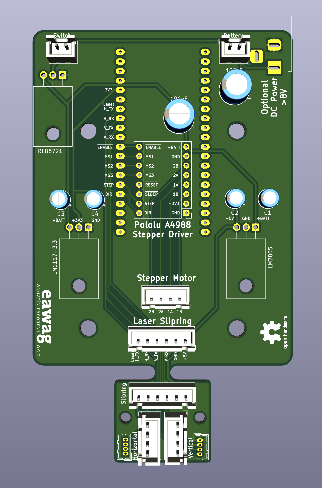

# Volaser PCB

The Volaser PCB connects the Sparkfun ESP32 microcontroller board which the servo motor controller and two lasers. It also hosts a 5V voltage regulator for the laser modules and a 3.3V regulator for the microcontroller and stepper motor driver. To make your own, send the gerber files to any PCB fabrication facility (an easy one to use is https://jlcpcb.com/).

- [Schematic](images/volaser_schematic.pdf)
- [PCB layout](images/volaser_pcb.pdf)

For assembly instructions look on the [wiki](https://github.com/volaser/volaser-cad/wiki/Volaser-PCB-Assembly).

The finished PCB should look something like this

