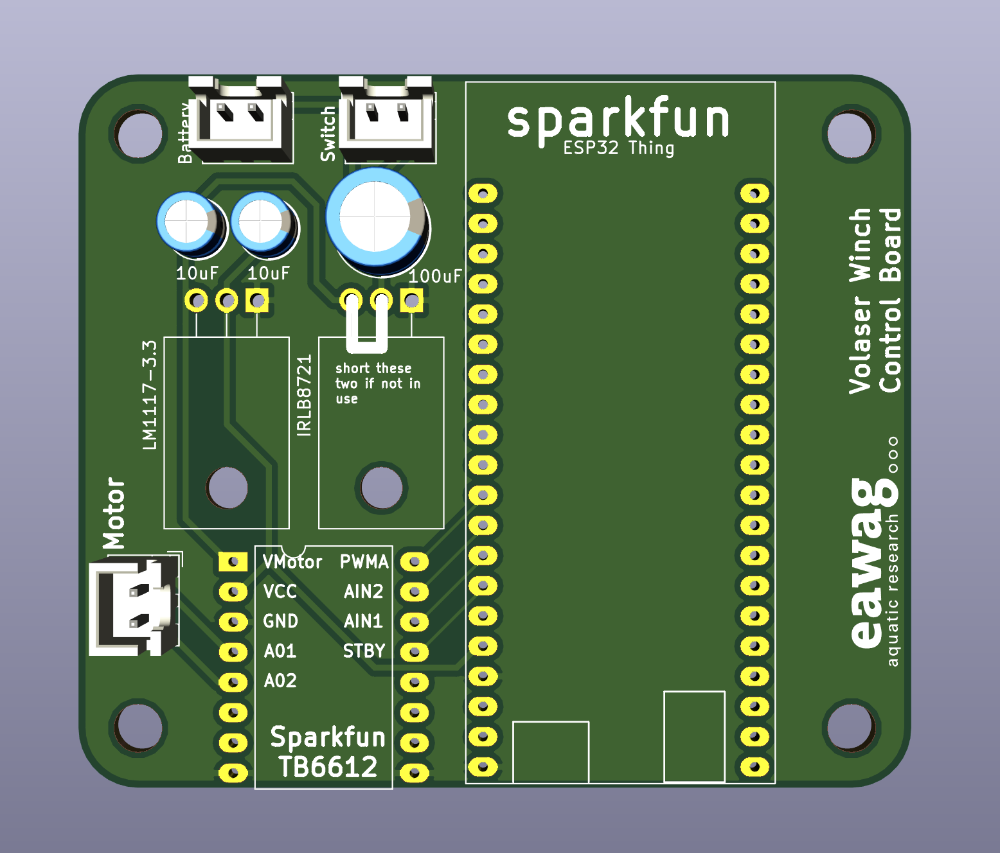

# Winch PCB

The Winch PCB connects the Sparkfun ESP32 microcontroller board with the motor controller, and also hosts a voltage regulator, as well as reverse polarity protection. To make your own, send the gerber files to any PCB fabrication facility (an easy one to use is https://jlcpcb.com/).

- [Schematic](images/winch_schematic.pdf)
- [PCB layout](images/winch_pcb.pdf)

For assembly instructions look on the [wiki](https://github.com/volaser/volaser-cad/wiki/Winch-PCB-Assembly).

The finished PCB should look something like this

